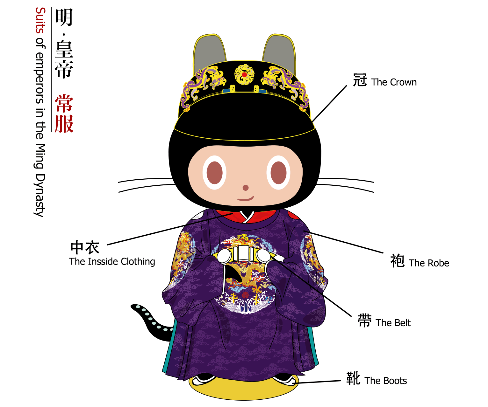

## Mingtocat

 

    
    

    <strong>Mingtocat</strong>, an emperor in the Ming Dynasty of China

 

![octcat](https://img.shields.io/badge/octcat-%E2%88%9E-aaaaaa.svg?logo=data%3aimage%2fpng%3bbase64%2ciVBORw0KGgoAAAANSUhEUgAAAEAAAABACAYAAACqaXHeAAAAGXRFWHRTb2Z0d2FyZQBBZG9iZSBJbWFnZVJlYWR5ccllPAAAAyRpVFh0WE1MOmNvbS5hZG9iZS54bXAAAAAAADw%2feHBhY2tldCBiZWdpbj0i77u%2fIiBpZD0iVzVNME1wQ2VoaUh6cmVTek5UY3prYzlkIj8%2bIDx4OnhtcG1ldGEgeG1sbnM6eD0iYWRvYmU6bnM6bWV0YS8iIHg6eG1wdGs9IkFkb2JlIFhNUCBDb3JlIDUuNS1jMDIxIDc5LjE1NDkxMSwgMjAxMy8xMC8yOS0xMTo0NzoxNiAgICAgICAgIj4gPHJkZjpSREYgeG1sbnM6cmRmPSJodHRwOi8vd3d3LnczLm9yZy8xOTk5LzAyLzIyLXJkZi1zeW50YXgtbnMjIj4gPHJkZjpEZXNjcmlwdGlvbiByZGY6YWJvdXQ9IiIgeG1sbnM6eG1wTU09Imh0dHA6Ly9ucy5hZG9iZS5jb20veGFwLzEuMC9tbS8iIHhtbG5zOnN0UmVmPSJodHRwOi8vbnMuYWRvYmUuY29tL3hhcC8xLjAvc1R5cGUvUmVzb3VyY2VSZWYjIiB4bWxuczp4bXA9Imh0dHA6Ly9ucy5hZG9iZS5jb20veGFwLzEuMC8iIHhtcE1NOkRvY3VtZW50SUQ9InhtcC5kaWQ6MzlFQkFERkU4NkJCMTFFM0FBNTJFRTMzNTJEMUJDNDYiIHhtcE1NOkluc3RhbmNlSUQ9InhtcC5paWQ6MzlFQkFERkQ4NkJCMTFFM0FBNTJFRTMzNTJEMUJDNDYiIHhtcDpDcmVhdG9yVG9vbD0iQWRvYmUgUGhvdG9zaG9wIENTNiAoTWFjaW50b3NoKSI%2bIDx4bXBNTTpEZXJpdmVkRnJvbSBzdFJlZjppbnN0YW5jZUlEPSJ4bXAuaWlkOkU1MTc4QTJFOTlBMDExRTI5QTE1QkMxMDQ2QTg5MDREIiBzdFJlZjpkb2N1bWVudElEPSJ4bXAuZGlkOkU1MTc4QTJGOTlBMDExRTI5QTE1QkMxMDQ2QTg5MDREIi8%2bIDwvcmRmOkRlc2NyaXB0aW9uPiA8L3JkZjpSREY%2bIDwveDp4bXBtZXRhPiA8P3hwYWNrZXQgZW5kPSJyIj8%2bKk5lQwAABYxJREFUeNrkm29oVXUYx3%2b7bM3V1FnbqlltrtXWtYRa1nqxooY5E7EhKWGuaTDBagol9SIMDCKICASj%2bcISw%2fDPi16ZBakrUBnoC7nNoTMWy6I1c%2bLmVq6t78N9jpyu555znt855%2b536IHPi939%2fjzP95zznN%2b%2fkzc1NaUitirwJJgPasF94DZQDG7hMqNgBFwEZ5kU%2bAH0R%2blcXgQCJMBT4EXwLKgM2N7P4FvwJegCk6YKUA5eB23grogu2C%2fgc7AN%2fGGKABTsZtAOZqjc2DjYAT5kUfSNBNCkAGwGo1PTZ6PsQ4FuHLp3QD3YDR5QZtgZsAac1ElYokcGbATHDApesS%2fkUwf7GEkOKAK7wAvKbNsPXgZjYQowG3wNnlDxsONgCbgchgAU%2fGHwiIqXUT5o8hLBKwfcDA7FMHgrUR%2fiGLQEoGTyBWhQ8bUGjiFPR4A3QIuKv7VwLKIcQMnue5Dv0fjT%2fIwtAM3g%2bRyMBmkU%2bBXf3qc5Rx3xqDPBE7LjfkaCheCcj1HYKYe6JeBt8GcEo75L3HaJQ7%2bnfNQ%2fx7H9p67TFX4L1Pi4EocdfhsGH4BPwVbwqu0xGwI%2f8vT2N%2f77Gv%2bvAJSCO3n6PJ%2f%2fVjz72w62cPtORnfAwx7%2b1nBsW93ugGow7vOKtPkYa9eDl0Clxji9kuvW%2byjb5tPncY7xet3MhjoFt2RzgIlU2DQL%2fO6017W%2fBe4BawXJqMCgTH%2bToOxajvWG1%2bAmYVBlBglQKrxwmzIFoB9XCzt91CABpL6sti62JcBiXtKS2GMGCSD1pZxjvi7AKmED9PraYJAAG2yvVL%2b2yi7AImHl90C3QQJ03%2fB%2b97ZF1lCYVlN6BBV%2fBffykNQkoyF4H5grqJOkO6BR2NF2A4O35gifCOs0JjTW9vYaPPPbJ11LJAFqBRVoDf68wQLQI3BBUL424XPiY1lvDOb%2fZwRla0iAOYIKv8dAgEFB2VtJgJmCChMxEEAyHigmAQoFFWbFQIDZgrKF0p2hmTEQQOQjCTAmKD8vBgJUCcqOkQBXBBXosEORwcEXKdmBjCskwICgQr5h0%2bBMW6i8V7LtNkAC9As7WWqwAM8Jy%2fcnhBMhspVKvq2eC0uwbxLrSWhMa%2bdpdJQLW6mRpLtpOlyuMcL7CTwErhoSPG2ApjQEuD3BQ0fp0ZJqlT6pZYpt0wieYh60nuWDGp2%2bAt4xIPgt7IvU0jHzBkFdgD27HWDGNGyGFHHfulaXuTN0IkBjZ8EykJeDwKmPFtAXwN8TTltjrVkKfwcawXJW3G3v8DTYCKoiCLwGvAl6QthpbnU6J5jP2f1uh1Wgxbbxwv0qvT%2fvtZRGA6wuzs50%2bPkb8JdgQtPMq1VJld7bnxtSzhjgJD5hzwEW611OZK6xlSvzeYbAsl3Cx4PK7ozodOl6t93hfJByqbzOVnYh%2bMdHhxfBLI1bnuoMhRx8imPMKgDR5LG%2fnrSVfddHpx8HeO4%2fClmApsw%2bsnXsdk7gYMat%2br5Hp0sDCLAkxOA7nfrI1nGxx2tmQUb5x8FuzgvD4Dw4wNm2MIAA1SEF38cx%2bRaAeBCMZGlwb44GOyUhBD%2fCsTj24TatpddXq3L%2bRIVmXnE4QzjJMaSylvBxFdqzKHsVrDD8Dmj36sOvIx0unewHDRENg4MI0BH2FyP0RcZOlzW3Ib7VLvPqDK0z1PEq7bDmLVwCLgnr0AhvnUp%2f0eJp0k9m6HO4fUp2nGZODgUY5PzUJVlHkxg1TEfnjxqY8I6yb12SSjqLm7T9%2fAx4TaW%2f%2bJxuIx862KcL4toBk1QFT1omXZLRHQHaL3Npl%2fr8jH3QjiGsbJ3kGd%2ffDo6WBWi31KG9a9xXMgzfw35tVfCR9l52dk8Ibe7htnq57YowfY7i4%2blYWUL9z%2b1fAQYACqstE4NCc18AAAAASUVORK5CYII%3d)  

**Mingtocat** is a designed octocat with clothing of emperors in the Ming Dynasty, and what we saw above is one of the informal uniforms. As an open source, Mingtocat is allowed to download in any picture format: [**SVG**](https://rawgit.com/aleen42/mingtocat/master/Mingtocat.svg) | [**PNG**](https://raw.githubusercontent.com/aleen42/mingtocat/master/Mingtocat.png) | [**GIF**](https://raw.githubusercontent.com/aleen42/mingtocat/master/Mingtocat.gif), but **business using must be refused**. What the purpose of designing is to make the history of Chinese clothing known by more people all over the world.

According to some study, the clothing shown above arose during the later stage of the Ming. In this stage, color of the clothing was not only set as yellow, what we normally see. Not only the color, but also the usage of dermatoglyphic pattern (紋樣) has changed into various. This clothing has been designed based on the artifacts drawn in the picture, named "Ru Bi (入跸圖)". The whole clothing has been divided into five parts: the crown, the robe (袍), the inside clothing (中衣), the belt (帶), and the boots.

### The Crown

There were two "ears" on the crown, and they were actually called "the Wing of WuSha (烏沙翼)". In the later stage of the Ming Dynasty, the shape this pair of wing, has become more and more round. In addition, there were some gold jewelries on the crown, with a meaning of "Double dragons were playing with a same peal".

### The Robe

Besides yellow, purple robe was usually used in a informal occasion. At the shoulder, there were two seals, which were respectively represented for the Sun (日) with a red color in the left side and the Moon (月) with a white color in the right side. A pattern with four encircling dragons (團龍), which was always four, sometimes eight or twelve, were embroidered (繡於) at the middle position and two sleeves. How elegant they were. Notice that the white parts of the inside clothing would be shown a little outside the sleeves named "Chen Bai (襯擺)".

### The Inside Clothing

The collar of the inside clothing was usually dressed into cross like the character `Y`, which was usually decorated with red or yellow color.

### The Belt

The belt was mainly designed with jades, and its color was usually red or yellow. In China, this belt was called "Dai Ting (帶鞓)".

### The Boots

The boots would always be black boots named "Zao Boots (皂靴)".

### References

[1] 《Q版大明衣冠图志》，董进（撷芳主人），2014
