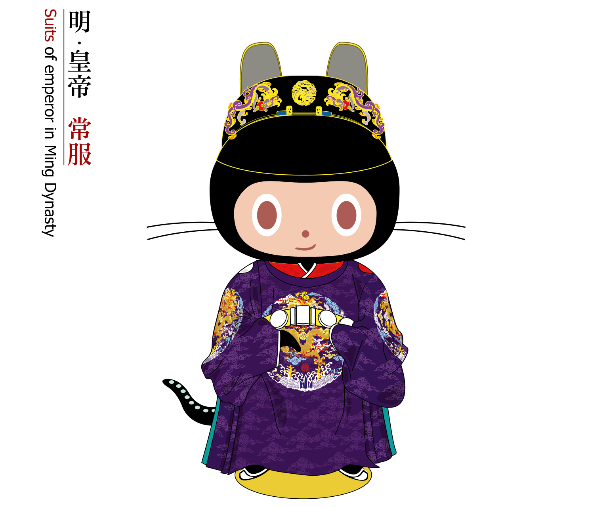

## Mingtocat

</img>

**Mingtocat** is a designed octocat with clothing of emperors in Ming Dynasty, and what we saw above is one of the formal uniforms. As an open source, Mingtocat is allowed to download in any picture format: SVG | PNG | GIF, but business using is refused.
